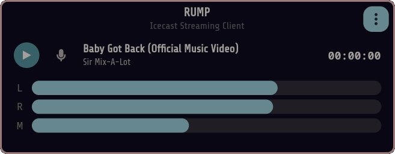
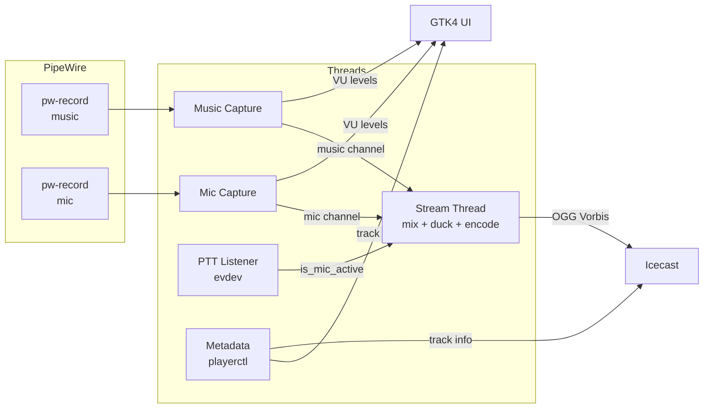

# RUMP

**R**adio **U**plink for **M**edia **P**ublishing

A clean, modern Icecast streaming client. Inspired by [BUTT](https://danielnoethen.de/butt/), rebuilt from scratch with a modern stack.

Built with Rust, GTK4/libadwaita, PipeWire, and OGG Vorbis.

## Features

- **Stream to Icecast**: OGG Vorbis encoding via direct HTTP SOURCE protocol
- **PipeWire native**: capture any audio source or sink monitor (desktop audio)
- **DJ mic mixing**: second audio source with push-to-talk and automatic music ducking
- **MPRIS metadata**: picks up track info from any media player via playerctl
- **Auto-reconnection**: recovers from Icecast connection drops (5 retries with backoff)
- **Always-on VU meters**: L/R music + mic level, active before streaming starts
- **Global push-to-talk**: evdev-based hotkey combos (e.g., Alt+Space), works on Wayland
- **Configurable encoding**: sample rate, channels, Vorbis quality
- **Configurable ducking**: threshold, duck level, attack/release/hold envelope

## Screenshot



## Install

### Dependencies (Arch Linux)

```sh
sudo pacman -S gtk4 libadwaita libvorbis libogg pipewire playerctl
```

### Build from source

```sh
git clone https://github.com/shaunlastra/rump.git
cd rump
cargo build --release
./target/release/rump
```

### Arch Linux (PKGBUILD)

```sh
makepkg -si
```

## Usage

1. Open **Preferences** (menu button) and configure:
   - **Audio tab**: select your input device (sink monitor for desktop audio), set encoding quality
   - **Microphone tab**: select mic, configure PTT key and ducking parameters
   - **Server tab**: set Icecast host, port, mount point, and source password

2. Click the **play button** to start streaming

3. **Push-to-talk**: hold the configured key combo (default: Alt+Space) or click the mic button to toggle

4. VU meters and MPRIS metadata are always live, even before streaming starts

## Architecture



## Configuration

Stored at `~/.config/rump/config.toml`:

```toml
host = "localhost"
port = 8001
mount = "/stream"
password = "hackme"
input_device = "Monitor of Built-in Audio Analog Stereo"
sample_rate = 44100
channels = 2
vorbis_quality = 0.4
mic_device = "USB PnP Audio Device Mono (mic)"
ptt_key = "Alt+Space"
duck_threshold = 0.02
duck_level = 0.2
duck_attack_ms = 100
duck_release_ms = 800
duck_hold_ms = 500
```

## Stack

| Component | Technology |
|-----------|-----------|
| UI | GTK4 + libadwaita |
| Audio capture | PipeWire (via pw-record) |
| Encoding | OGG Vorbis (vorbis_rs) |
| Streaming | Direct HTTP SOURCE to Icecast |
| Metadata | playerctl (MPRIS/D-Bus) |
| Push-to-talk | evdev (global keyboard events) |
| Config | TOML (serde) |

## Requirements

- PipeWire (with pw-record)
- Icecast 2.4+
- User must be in the `input` group for global PTT hotkeys
- Wayland or X11

## License

MIT
